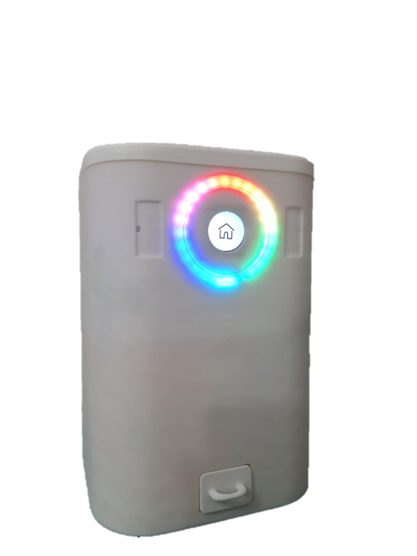
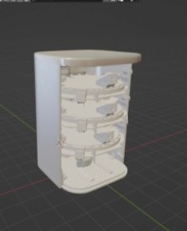
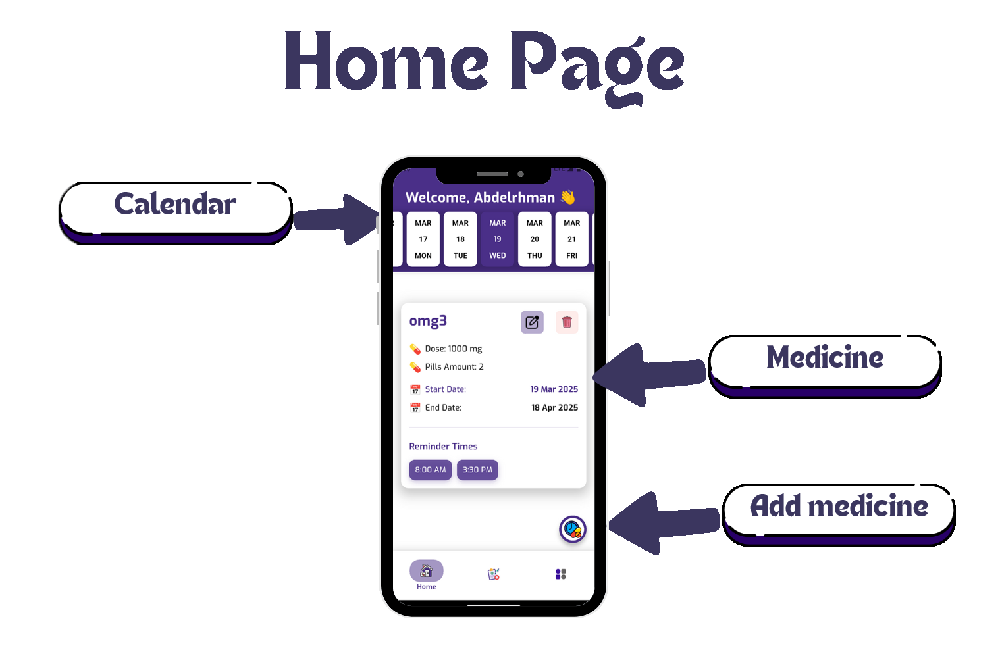
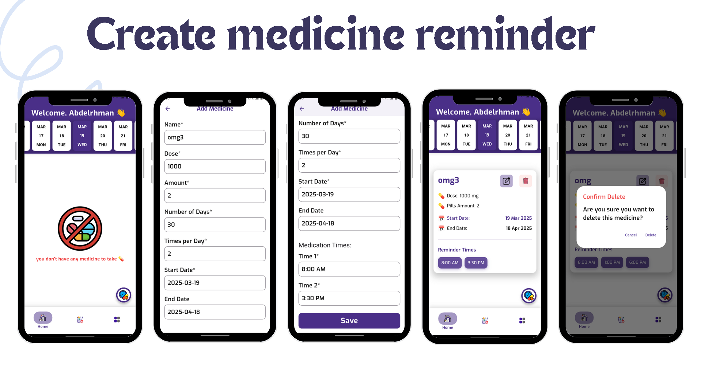

# Smart Medical Pill Dispenser

An IoT-powered, AI-enhanced smart pill dispenser designed to improve medication adherence, especially for elderly patients and those with chronic conditions. The system combines automated hardware, a cross-platform mobile app, and cloud-based analytics to ensure the right dose at the right time.

---

## 📸 Device Preview

| Powered On                             | Internal View                          |
|----------------------------------------|----------------------------------------|
|  |   |

---

## 🎞 Demo

---
## 🎞 Mobile Demo

---

## 🚀 Features

### Hardware
- ESP32-based controller with Bluetooth & Wi-Fi
- 3D-printed rotating pill tray with servo & stepper motors
- Rounded TFT LCD interface
- Sensors: IR, temperature, distance (VL53L0X)
- Audio alerts via MP3 module
- RGB LED indicators
- Rechargeable battery support

### Software
- 📱 **Mobile App** (Flutter)
  - Add/manage medication schedules
  - Real-time reminders & notifications
  - Health monitoring (Temp, Oxygen)
  - AI-powered chatbot & tips
  - Drug interaction checker
  - Caregiver integration

- 🧠 **Backend (.NET + AI)**
  - Drug alternative suggestions
  - Health log processing
  - Secure data storage

- 💻 **Web Interface** (Next.js)
  - Drug search & alternative finder
  - Responsive design (light/dark mode)

---

## 🧱 Architecture

| Component | Description |
|-----------|-------------|
| `hardware/` | Circuit diagrams, pinout, 3D models |
| `firmware/` | ESP32 C++ code |
| `mobile-app/` | Flutter source code |
| `backend/` | .NET backend services |
| `web-app/` | React/Next.js web tool |
| `images/` | Screenshots of app/device |
| `gifs/` | Demonstration animations |

---

## 🔧 Technologies Used

| Domain       | Tools / Languages |
|--------------|--------------------|
| Mobile       | Flutter, Dart      |
| Backend      | .NET, C#, Python   |
| Hardware     | ESP32, C/C++       |
| Web          | React, Next.js     |
| 3D Design    | Blender            |
| Version Ctrl | Git, GitHub        |

---

## 📄 Report

You can find the full documentation of this project in the [Final Report PDF](./SmartPill_Final_Report.pdf).

---

## 📬 Contact

> Graduation Team – Future Institute 2025  
> Mohamed Emad, Abdelrahman Mohamed, Ahmed Abdelrafea, Ahmed Tarek, Mostafa Shawkey, Fady Alamir

For inquiries or collaboration, feel free to contact us!

---

## 🏆 Achievements
🥇 1st Place - Regional Level in the "Geniuses - Integrated Systems" Competition.

🥈 2nd Place - Nationwide in the "Science Club National Competition".

## 🪪 License

This project is open-source and licensed under the [MIT License](./LICENSE).
